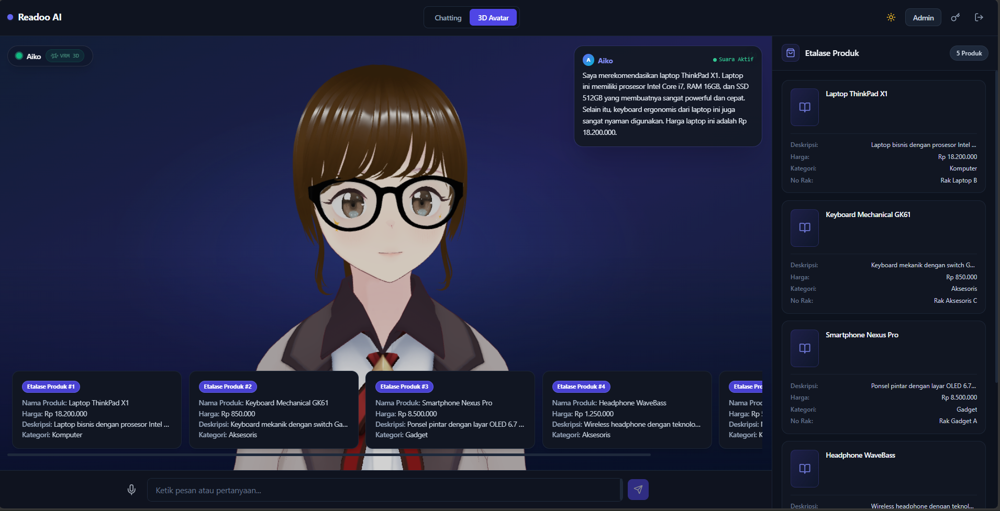
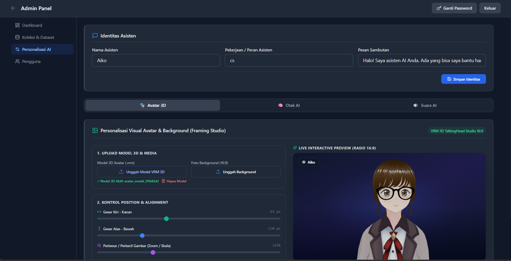
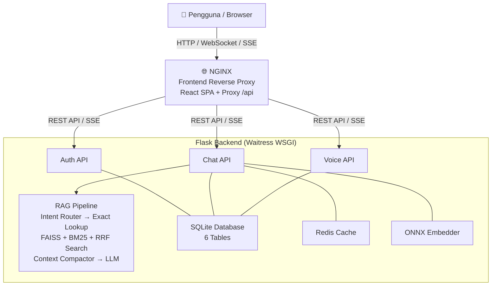

# Readoo AI

[](https://python.org)
[](https://react.dev)
[](https://www.typescriptlang.org/)
[](https://flask.palletsprojects.com)
[](https://www.docker.com)
[](LICENSE)

---

## 📖 Description

**Readoo AI** adalah platform **asisten AI cerdas berbasis RAG (Retrieval-Augmented Generation)** yang dirancang untuk pengalaman belanja dan pencarian produk secara interaktif — dengan dukungan **teks, suara, dan avatar 3D VRM**.

Dibangun di atas arsitektur modern *Full-Stack AI*, Readoo AI memungkinkan bisnis memiliki asisten virtual yang dapat memahami pertanyaan pelanggan, memberikan rekomendasi produk dari katalog mereka sendiri, dan berbicara layaknya tenaga penjual profesional.

### 📸 Preview Tampilan

| 3D Avatar Mode | Admin Panel |
|:---:|:---:|
|  |  |

---

## ✨ Features

| Fitur | Deskripsi |
|---|---|
| **🤖 RAG Pipeline** | FAISS semantic search + BM25 keyword search + Reciprocal Rank Fusion (RRF) untuk hasil pencarian produk yang presisi |
| **🎙️ 3D Avatar VRM** | Avatar karakter 3D format `.vrm` dengan lipsync/viseme otomatis saat berbicara, animasi idle, dan eye-blink |
| **🎤 Speech-to-Text (STT)** | OpenAI Whisper (lokal) atau Groq Cloud API untuk transkripsi suara pengguna |
| **🔊 Text-to-Speech (TTS)** | Edge-TTS (gratis, online) atau Supertonic ONNX (lokal) dengan pilihan suara berdasarkan gender avatar |
| **💬 Streaming Realtime** | Server-Sent Events (SSE) — respons AI mengalir realtime seperti ChatGPT |
| **🏪 Etalase Produk Bernomor** | Kartu produk diberi label `Etalase Produk #1`, `#2`, dst., AI mengarahkan pelanggan ke nomor etalase tertentu |
| **🎯 Intent Router** | Sistem pendeteksi intent berbasis rule (< 0.1ms) — sapaan dijawab instan tanpa memanggil LLM |
| **⚡ Exact Lookup Cache** | Cache jawaban produk yang sudah pernah ditanyakan untuk respons instan (< 20ms) |
| **📚 Dataset Kustom** | Upload CSV/Excel → pilih kolom embedding & display → auto-embedding ONNX → siap ditanyakan |
| **🌐 Multi-Provider LLM** | Groq, OpenAI, Gemini, DeepSeek, Ollama, OpenRouter — konfigurasi dinamis via Admin Panel |
| **🔐 Keamanan Enkripsi** | API key LLM disimpan terenkripsi (Fernet) di database, password di-hash dengan bcrypt |
| **👨‍💼 Admin Panel** | Kelola koleksi RAG, dataset, pengaturan LLM/TTS, manajemen user, konfigurasi avatar — semua dalam satu UI |
| **🌙 Dark/Light Mode** | Toggle tema di seluruh halaman |
| **⚡ Redis Cache** | Rate limiting, session store, dan caching terdistribusi (dengan fallback in-memory) |
| **🐳 Docker Ready** | Siap deploy production dengan Docker Compose + Nginx reverse proxy + security headers |

---

## 🏗️ Project Architecture



### Alur Percakapan RAG:
```
User Pesan → Intent Router (< 0.1ms) ──┬── Sapaan → Respon Instan
                                        └── Produk → Exact Lookup Cache (< 20ms)
                                                       └── Cache Miss → FAISS + BM25 + RRF Search
                                                                         └── Context Compactor
                                                                               └── LLM Synthesis
                                                                                     └── Respon + Kartu Etalase
```

---

## 📁 Project Structure

```
readoo-ai/
├── backend/                          # Python Flask API
│   ├── Dockerfile                    # Production Docker image (non-root, ffmpeg)
│   ├── main.py                       # Entry point (Waitress WSGI)
│   ├── requirements.txt
│   └── app/
│       ├── api/                      # REST API Endpoints
│       │   ├── auth.py               # Register, Login, Logout, Change Password
│       │   ├── chat.py               # Chat Text / Streaming / Avatar + Sessions
│       │   ├── voice.py              # STT (Whisper) + TTS (Edge-TTS/Supertonic)
│       │   └── admin/
│       │       ├── avatar.py         # Upload VRM avatar, background image
│       │       ├── collections.py    # CRUD RAG Collections + rebuild FAISS
│       │       ├── dataset.py        # Upload CSV/Excel, import, export
│       │       ├── llm.py            # Test LLM + auto-detect models
│       │       └── settings.py       # System settings + user management
│       ├── core/
│       │   ├── config.py             # Environment config (pydantic-settings)
│       │   ├── security.py           # bcrypt + Fernet encryption
│       │   └── validators.py         # Pydantic validators
│       ├── infrastructure/
│       │   ├── database.py           # SQLite schema + seed
│       │   ├── vector_store.py       # FAISS + BM25 + RRF Hybrid Search
│       │   ├── exact_lookup.py       # In-memory exact answer cache
│       │   ├── stt_client.py         # Whisper STT client
│       │   └── tts_client.py         # Edge-TTS / Supertonic TTS client
│       ├── repositories/             # Database access layer (SQLite)
│       └── services/
│           ├── chat_service.py       # RAG pipeline orchestration
│           ├── intent_router.py      # Rule-based intent detection
│           ├── context_compactor.py  # RAG context compression
│           └── speech_service.py     # Speech generation service
│
├── frontend/                         # React 18 + TypeScript + Tailwind CSS
│   ├── Dockerfile                    # Multi-stage build (Node 20 + Nginx Alpine)
│   ├── nginx.conf                    # Nginx reverse proxy + security headers
│   └── src/
│       ├── pages/
│       │   ├── ChatPage.tsx          # Main chat UI (Text + 3D Avatar mode)
│       │   ├── AdminPage.tsx         # Admin panel
│       │   └── LoginPage.tsx         # Authentication
│       ├── components/
│       │   ├── chat/
│       │   │   ├── VrmTalkingHeadAvatar.tsx  # 3D VRM Avatar dengan lipsync
│       │   │   ├── ItemCard.tsx              # Etalase produk card
│       │   │   └── RagInspector.tsx          # RAG Inspector panel
│       │   └── admin/
│       │       ├── PersonalisasiTab.tsx      # Avatar & TTS settings
│       │       └── CollectionsTab.tsx        # RAG collection management
│       └── services/
│           └── api.ts                # API client (Axios-like fetch wrapper)
│
├── docs/                             # Project documentation & screenshots
├── docker-compose.yml                # Production orchestration (Backend + Frontend + Redis)
├── .env.example                      # Environment variable template
├── DOCKER_GUIDE.md                   # Panduan Docker & security hardening
└── .gitignore
```

---

## ✅ Prerequisites

Pastikan Anda sudah menginstal:

- **Docker** (v20.10+) & **Docker Compose** (v2.0+) — untuk menjalankan dengan Docker
- **Python 3.11+** — untuk menjalankan secara manual
- **Node.js 20+** & **npm** — untuk development frontend
- **ffmpeg** — diperlukan untuk pemrosesan audio STT (Whisper)

---

## ⚙️ Installation

### Cara 1: Docker (Direkomendasikan untuk Production)

```bash
# 1. Clone repositori
git clone https://github.com/username/readoo-ai.git
cd readoo-ai

# 2. Buat file environment dari template
cp .env.example .env

# 3. Edit .env — ganti ENCRYPTION_KEY dan credentials default
#    (Generate key baru: python -c "from cryptography.fernet import Fernet; print(Fernet.generate_key().decode())")
nano .env

# 4. Jalankan dengan Docker Compose
docker-compose up -d --build

# 5. Akses aplikasi
# Frontend: http://localhost
# Backend Health: http://localhost:5000/api/health
```

### Cara 2: Manual (Development)

```bash
# 1. Clone repositori
git clone https://github.com/username/readoo-ai.git
cd readoo-ai

# 2. Setup Backend
cp .env.example .env
cd backend
python -m venv venv
venv\Scripts\activate        # Windows
# source venv/bin/activate   # Linux/Mac
pip install -r requirements.txt
python main.py               # Backend berjalan di http://localhost:5000

# 3. Setup Frontend (terminal baru)
cd frontend
npm install
npm run dev                  # Frontend berjalan di http://localhost:3000
```

---

## 🚀 Quick Start

Setelah aplikasi berjalan:

1. **Buka** `http://localhost` (Docker) atau `http://localhost:3000` (dev)
2. **Login** dengan akun default:
   - Admin: `admin` / `admin`
   - User: `user` / `user`
3. **Konfigurasi di Admin Panel** (`/admin`):
   - Masukkan **LLM API Key** (Groq/OpenAI/dll.) di tab **Pengaturan**
   - Upload **dataset produk** CSV/Excel di tab **Koleksi**
   - Upload **avatar VRM** `.vrm` di tab **Personalisasi**
   - Atur **suara TTS** dan **jenis kelamin avatar** sesuai preferensi
4. **Mulai Chat** — tanyakan produk dari dataset Anda!

> 💡 **Tips Keamanan Produksi**: Ganti `ADMIN_PASSWORD`, `DEMO_PASSWORD`, dan `ENCRYPTION_KEY` di `.env` sebelum deploy ke server publik. Panduan lengkap ada di [DOCKER_GUIDE.md](DOCKER_GUIDE.md).

---

## 🤝 Contributing

Kontribusi sangat disambut! Ikuti langkah-langkah berikut:

1. **Fork** repositori ini
2. **Buat branch** fitur baru:
   ```bash
   git checkout -b feature/nama-fitur-anda
   ```
3. **Commit** perubahan Anda:
   ```bash
   git commit -m "feat: tambahkan fitur baru"
   ```
4. **Push** ke branch Anda:
   ```bash
   git push origin feature/nama-fitur-anda
   ```
5. **Buat Pull Request** ke branch `main`

### Panduan Gaya Kode:
- **Backend**: Ikuti pola `Controller → Service → Repository`. Gunakan tipe Python hints.
- **Frontend**: Ikuti pola `Component → Store → Service`. PascalCase untuk komponen.
- **Commit Message**: Gunakan format Conventional Commits (`feat:`, `fix:`, `docs:`, `refactor:`).

---

## 📄 License

Proyek ini dilisensikan di bawah **MIT License** — lihat berkas [LICENSE](LICENSE) untuk detail lengkap.

---

## 🙏 Acknowledgements

Readoo AI dibangun di atas bahu raksasa-raksasa teknologi open source berikut:

| Library / Tool | Kegunaan |
|---|---|
| [LiteLLM](https://github.com/BerriAI/litellm) | Unified interface ke 100+ LLM provider |
| [FAISS (Facebook AI)](https://github.com/facebookresearch/faiss) | Vector similarity search yang ultra-cepat |
| [OpenAI Whisper](https://github.com/openai/whisper) | Speech-to-Text open source |
| [Edge-TTS (Microsoft)](https://github.com/rany2/edge-tts) | Text-to-Speech gratis berkualitas tinggi |
| [Three-VRM (Pixiv)](https://github.com/pixiv/three-vrm) | Rendering avatar 3D VRM di browser |
| [React 18](https://react.dev) | Library UI berbasis komponen |
| [Tailwind CSS](https://tailwindcss.com) | Utility-first CSS framework |
| [Flask](https://flask.palletsprojects.com) | Lightweight Python web framework |
| [sentence-transformers](https://www.sbert.net) | ONNX embedding model untuk RAG |
| [Nginx](https://nginx.org) | High-performance web server & reverse proxy |

---

<div align="center">

Made with ❤️ by the Readoo AI Team

</div>
